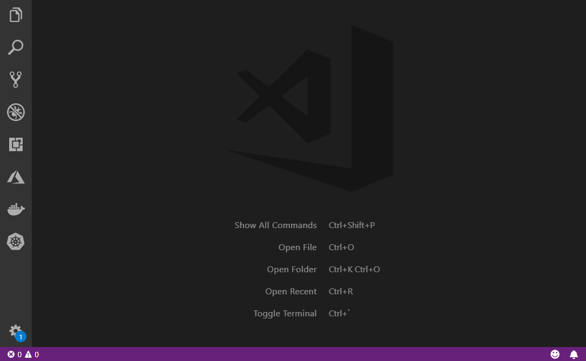

# Spring Initializr Java Support
[](https://marketplace.visualstudio.com/items?itemName=vscjava.vscode-spring-initializr)
[](https://marketplace.visualstudio.com/items?itemName=vscjava.vscode-spring-initializr)
[](https://marketplace.visualstudio.com/items?itemName=vscjava.vscode-spring-initializr)
[](https://gitter.im/DevDivSpring/Lobby)

## Overview
Spring Initializr is a lightweight extension to quickly generate a Spring Boot project in Visual Studio Code (VS Code). It helps you to customize your projects with configurations and manage Spring Boot dependencies.  

 

## Feature List

- Generate a Maven/Gradle Spring Boot project 
- Customize configurations for a new project (language, Java version, group id, artifact id, boot version and dependencies)
- Search for dependencies
- Quickstart with last settings
- Edit Spring Boot dependencies of an existing Maven Spring Boot project

## Requirements
- VS Code (version 1.19.0 or later)
- JDK (version 1.8.0 or later)

## Install

Open VS Code and press `F1` or `Ctrl + Shift + P` to open command palette, select **Install Extension** and type `vscode-spring-initializr`.

Or launch VS Code Quick Open (`Ctrl + P`), paste the following command, and press enter.
```bash
ext install vscode-spring-initializr
```

## Use

- Launch VS Code
- Press `Ctrl + Shift + P` to open command palette.
- Type `Spring Initializr` to start generating a Maven or Gradle project.
- Follow the wizard.
- Right click inside the `pom.xml` file and choose `Edit starters` for dependency refactoring. (Gradle project is not supported yet, PR is welcome for it.)

## Configuration
```
  // Default language.
  "spring.initializr.defaultLanguage": "Java",

  // Default Java version.
  "spring.initializr.defaultJavaVersion": "11",

  // Default value for Artifact Id.
  "spring.initializr.defaultArtifactId": "demo",

  // Default value for Group Id.
  "spring.initializr.defaultGroupId": "com.example",

  // Spring Initializr Service URL(s). If more than one url is specified, it requires you to select one every time you create a project.
  "spring.initializr.serviceUrl": [ "https://start.spring.io" ],

  // Default value for Packaging. Supported values are "JAR" and "WAR".
  "spring.initializr.defaultPackaging": "JAR",

  // Default value for the method of openining the newly generated project. Supported values are "", "Open" and "Add to Workspace".
  "spring.initializr.defaultOpenProjectMethod": "Add to Workspace",
```

## Feedback and Questions
You can find the full list of issues at [Issue Tracker](https://github.com/Microsoft/vscode-spring-initializr/issues). You can submit a [bug or feature suggestion](https://github.com/Microsoft/vscode-spring-initializr/issues/new), and participate community driven [](https://gitter.im/DevDivSpring/Lobby?source=orgpage)

## License
This extension is licensed under [MIT License](./LICENSE.txt).

## Data/Telemetry
VS Code collects usage data and sends it to Microsoft to help improve our products and services. Read our [privacy statement](http://go.microsoft.com/fwlink/?LinkId=521839) to learn more. If you don’t wish to send usage data to Microsoft, you can set the `telemetry.enableTelemetry` setting to `false`. Learn more in our [FAQ](https://code.visualstudio.com/docs/supporting/faq#_how-to-disable-telemetry-reporting).

## Contributing
This project has adopted the [Microsoft Open Source Code of Conduct](https://opensource.microsoft.com/codeofconduct/). For more information see the [Code of Conduct FAQ](https://opensource.microsoft.com/codeofconduct/faq/) or contact [opencode@microsoft.com](mailto:opencode@microsoft.com) with any additional questions or comments.
